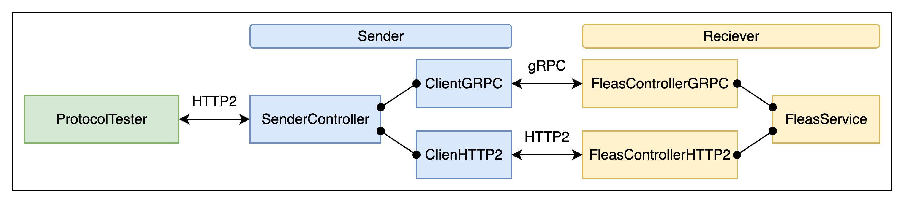
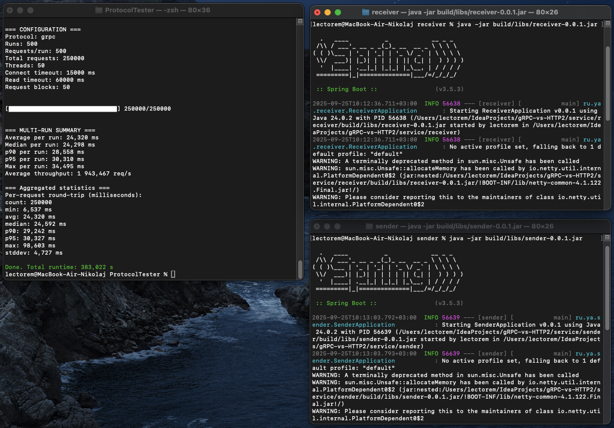
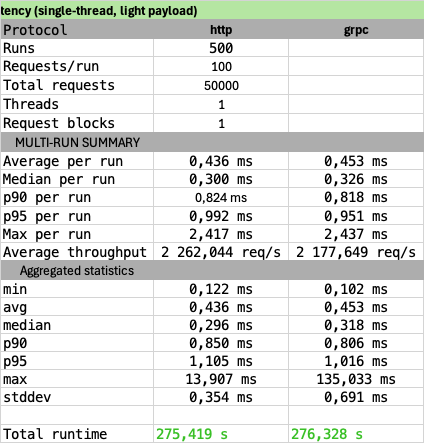
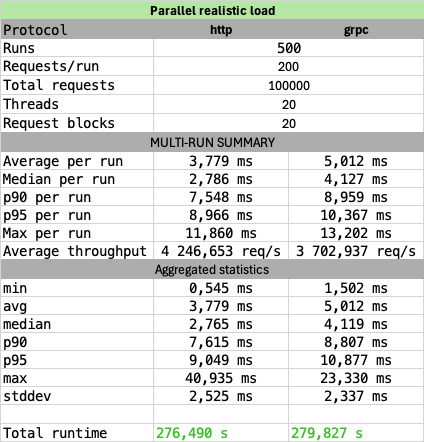
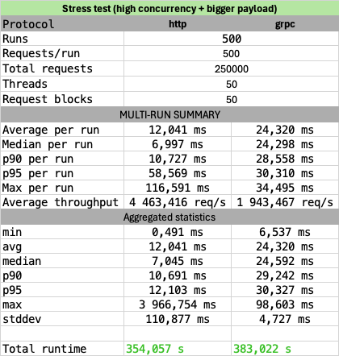

# gRPC-vs-HTTP2

## Архитектура проекта 

Проект построен в микросервисной архитектуре с единой точкой входа и отдельной libs для моделей.
Единая точка входа - REST API модуля sender - с единственным POST-эндпоинтом "/api/sender/send", где можно выбрать 
протокол передачи данных (HTTP/2 или gRPC) и отправить поток задач. В зависимости от выбора, sender использует 
соответствующий клиент: ClientHttp2 для WebFlux или ClientGRPC для gRPC. Оба клиента обращаются к целевому сервису 
receiver, который решает одну и ту же задачу и возвращает результат.

Для gRPC в модуле receiver используется класс-контроллер на основе FleasServiceGrpc.FleasServiceImplBase, а для HTTP/2 
реализован REST-контроллер на WebFlux. Оба они принимают поток задач и возвращают поток ответов. Это важно: везде 
используется именно потоковое взаимодействие (Flux/StreamObserver), чтобы максимально показать возможности 
обоих подходов.

Отдельный модуль libs содержит общие DTO, используемые всеми сервисами, а также .proto-файл для генерации gRPC-классов. 
Таким образом, повторное использование кода упрощено и нет дублирования структур данных.

Сама бизнес-логика предельно проста: сервис receiver получает алгоритмическую задачу и решает ее методом BFS - это не 
имеет отношения к протоколу, просто одинаково загружает оба пути взаимодействия.

### Технологии
- Spring Boot + WebFlux для реализации реактивного HTTP/2-сервиса,
- gRPC + protobuf для бинарного взаимодействия,
- Reactor (Flux/Mono) для обработки асинхронных потоков,
- Lombok для сокращения шаблонного кода DTO,
- Gradle для сборки и генерации Java-классов из .proto.

### Примечание 
Некоторые метрики, такие как время сериализации, десериализации, сетевой задержки и общее время обработки, были 
заложены в модель FleasAnswerWithMetricsDto. Сейчас они расставлены не везде корректно, и использовать их для выводов
нельзя. Поэтому в анализе я их игнорирую, оставив только как технический артефакт, который в будущем можно доделать.

## Удобство использования REST и gRPC
Помимо измерений производительности, в проекте оказалось полезным сравнить субъективное удобство работы с самими 
технологиями. REST (WebFlux) оставил гораздо более приятное впечатление.

С gRPC же возник целый ряд проблем:
- Во-первых, генерация кода из proto3 в Java создаёт довольно странные конструкции: 
в именах переменных появляются цифровые индексы, что сразу сбивает с толку и делает код менее читаемым. 
- Во-вторых, и контроллер, и клиент на gRPC получились существенно тяжелее: объём кода там в разы больше, 
чем у аналогичного решения на REST. Это связано с тем, что приходится вручную работать с StreamObserver, 
дополнительно следить за сериализацией/десериализацией и явно строить DTO для каждого шага.

Особенно заметно это на простых сценариях. Например, чтобы реализовать через gRPC банальный GET с одним параметром, 
нужно заводить отдельный protobuf-класс с одним полем. Для REST же это сводится к одной строке в контроллере. 

В результате gRPC ощущается более громоздким и требует значительно больше времени на разработку и отладку.

## Инструмент тестирования 
Чтобы сравнить gRPC и REST по производительности, я написал отдельную утилиту-нагрузчик на чистой Java. Она 
взаимодействует с API стенда по URL "/api/sender/send?protocol=", и выполняет пачки запросов.

Программа работает сериями прогонов: каждый прогон выполняет несколько запросов, при этом сами запросы распределяются 
по пулу потоков. Это позволяет имитировать нагрузку с параллельным обращением, а не одиночными вызовами. Для каждого 
запроса измеряется полный round-trip time — от отправки JSON до получения ответа.

Запросы заранее генерируются как массивы. Это статический блок, чтобы результаты были максимально стабильными.

После завершения каждого прогона утилита собирает статистику: среднее время ответа, медиану, p90/p95 перцентили, 
максимум, а также throughput (сколько запросов в секунду получилось «продавить»). Прогресс выполнения выводится в 
консоль в виде небольшой ASCII-шкалы, а в конце печатается сводная статистика по всем прогонам сразу.

Утилита гибко настраивается через константы в коде: можно выбрать протокол (http или grpc), количество прогонов, число 
запросов на прогон, размер пула потоков, а также таймауты соединения и чтения. Все результаты выводятся прямо в 
консоль.

## Тестовое окружение
Все замеры выполнялись на MacBook Air M4, работающем от сети (не на батарее), чтобы исключить динамическое занижение 
частот процессора. Для минимизации системных помех я полностью закрыл все лишние программы и оставил запущенными 
только стенд и утилиту нагрузочного тестирования. Проект имеет докер схему для запуска но я решил провести тестирование 
на нативной Java:

Всё взаимодействие шло по localhost, то есть сетевые задержки фактически отсутствовали, 
и тесты отражали именно разницу протоколов, а не сети.

## Обзор метрик и их расшифровка
Скрипт меряет round-trip-time в наносекундах (с высокой точностью), переводит в миллисекунды для вывода, собирает 
метрики по каждому прогону и также аккумулирует все успешные запросы для «пул-статистики». Обращаю внимание: в расчёты 
попадают только успешные запросы (которые добавились в durationsNs), неудачные инкрементируют счётчик ошибок, но не 
участвуют в перцентилях.

### Конфигурационные поля (задаётся в коде)

| Поле           | Описание                                              |
|----------------|-------------------------------------------------------|
| Protocol       | выбранный протокол (http или grpc)                    |
| Runs           | количество полных серий прогонов (RUNS)               |
| Requests/run   | количество запросов в одном прогоне (ITERATIONS)      |
| Total requests | общее число запросов                                  |
| Threads        | размер пула потоков, одновременно выполняющих запросы |
| Request blocks | количество элементов в теле запроса                   |

### MULTI-RUN SUMMARY — поля и пояснение

Показывает поведение «на уровне прогонов» — каждую серию тестов мы рассматриваем как отдельный эксперимент, из каждого 
прогона берём ключевые числа, а потом усредняем их по всем прогонам. Это удобно, когда важно понять среднюю отзывчивость 
и пропускную способность при повторяемых сериях (как меняется метрика от прогона к прогону).

| Поле               | Описание                                                                   |
|--------------------|----------------------------------------------------------------------------|
| Average per run    | среднее время запроса по всем прогонам (ms)                                |
| Median per run     | медиана времени запроса по всем прогонам (ms)                              |
| p90 per run        | 90-й перцентиль по каждому прогону, затем среднее по всем прогонам (ms)    |
| p95 per run        | 95-й перцентиль по каждому прогону, затем среднее по всем прогонам (ms)    |
| Max per run        | максимальная задержка в каждом прогоне, затем среднее этих максимумов (ms) |
| Average throughput | средняя пропускная способность по всем прогонам (req/s)                    |

### Aggregated statistics — поля и пояснение

Складывает все успешные измерения в одну большую выборку и на ней считает перцентили, медиану, среднее и т. д. 
Это полезно, когда нужно оценить реальное распределение латентностей (включая хвосты) без «усреднения по прогонам».

| Поле          | Описание                                                                  |
|---------------|---------------------------------------------------------------------------|
| min           | минимальное значение round-trip среди всех успешных запросов (ms)         |
| avg           | среднее время round-trip по всем успешным запросам (ms)                   |
| median        | медиана всех успешных запросов (ms)                                       |
| p90           | 90-й перцентиль всех успешных запросов (ms)                               |
| p95           | 95-й перцентиль всех успешных запросов (ms)                               |
| max           | максимальное значение задержки среди всех успешных запросов (ms)          |
| stddev        | стандартное отклонение по всем успешным запросам (ms), показывает разброс |
| Total runtime | общее время выполнения тестов (s)                                         |

## Результаты тестирования

| Эксперимент                                     | PROTOCOL    | RUNS  | ITERATIONS   | THREAD_COUNT   | REQUEST_BLOCK_COUNT   | Что замеряем                                                                                                                                               |
|-------------------------------------------------|-------------|-------|--------------|----------------|-----------------------|------------------------------------------------------------------------------------------------------------------------------------------------------------|
| Base latency (single-thread, light payload)     | http / grpc | 500   | 100          | 1              | 1                     | Измерение «чистой» задержки без конкуренции: один поток, минимальный payload. Большое число прогонов нужно для усреднения и отсеивания случайных выбросов. |
| Parallel realistic load                         | http / grpc | 500   | 200          | 20             | 20                    | Типовой рабочий сценарий: средний payload и умеренная параллельность. Показывает, как протоколы ведут себя при реальной нагрузке.                          |
| Stress test (high concurrency + bigger payload) | http / grpc | 500   | 500          | 50             | 50                    | Тяжёлый сценарий: высокая конкуренция и увеличенный payload. Замер масштабируемости, стабильности и деградации при перегрузке.                             |

### Base latency (single-thread, light payload)  

Средняя и медианная задержка для HTTP/2 и gRPC практически идентичны: около 0,44–0,45 мс в среднем и ~0,3мс медиана, 
что говорит о том, что «чистая» латентность без конкуренции у обоих протоколов очень низкая и близка друг к другу. 
90-й и 95-й перцентили тоже почти совпадают, но заметно, что у gRPC стандартное отклонение выше (0,691мс против 0,354мс
у HTTP), а максимальная задержка выстрелила в 135 мс, что отражает редкие выбросы и потенциальную чувствительность 
gRPC к отдельным операциям сериализации/десериализации при очень маленькой нагрузке.

Вывод: при минимальной нагрузке оба протокола дают почти одинаковую «чистую» задержку, но gRPC демонстрирует чуть более 
высокую вариативность, что можно учитывать при системах с жёсткими требованиями к tail-latency. Throughput близок к
2200–2260req/s, что для одного потока соответствует ожидаемым возможностям локального стенда.

### Parallel realistic load

HTTP/2 показывает среднее время ответа около 3,78мс, медиану 2,78мс, тогда как у gRPC среднее выше — 5,01мс, медиана 
4,13мс. 90-й и 95-й перцентили также у gRPC выше, что указывает на большую латентность при параллельной нагрузке. 
Throughput HTTP/2 выше — 4 246 req/s против 3 703 req/s у gRPC, то есть REST WebFlux в этой конфигурации справляется 
с нагрузкой эффективнее.

Вывод: при типичной многопоточной нагрузке HTTP/2 выигрывает по скорости и пропускной способности, gRPC остаётся 
стабильным, но демонстрирует большую задержку на tail-перцентили. Максимальные значения показывают редкие выбросы у 
обоих протоколов, но в целом распределение латентности у gRPC смещено вправо.

### Stress test (high concurrency + bigger payload)

В стресс-тесте с высокой конкуренцией и увеличенным payload разрыв между протоколами становится очень заметным. 
HTTP/2 демонстрирует среднее время ответа 12 мс и медиану около 7 мс, в то время как gRPC почти в два раза медленнее — 
среднее 24,3 мс и медиана 24,3 мс. 90-й и 95-й перцентили у gRPC также выше, хотя у HTTP/2 наблюдается крайне высокое 
значение максимальной задержки, что связано с редкими выбросами под нагрузкой.

Throughput показывает явное преимущество HTTP/2: 4 463 req/s против 1 943 req/s у gRPC, что говорит о том, что WebFlux 
справляется с высокой параллельностью и большим payload лучше, чем gRPC в данной реализации.

Вывод: при экстремальной нагрузке REST WebFlux остаётся значительно более производительным и предсказуемым по 
латентности, тогда как gRPC показывает рост задержек и меньшую пропускную способность, что подтверждает наблюдения из 
предыдущих тестов о более «тяжеловесной» природе gRPC-клиентов и сложности обработки больших потоков данных.

## Общие выводы

Сравнение показало, что при минимальной нагрузке оба протокола дают почти одинаковую «чистую» латентность — среднее 
время ответа в районе 0,4–0,45 мс на один запрос. При увеличении параллельности и payload HTTP/2 через WebFlux начинает 
демонстрировать явное преимущество: меньшие средние и медианные задержки, выше пропускная способность и более 
предсказуемое распределение латентности.

gRPC показал себя стабильным, но более «тяжеловесным»: клиенты и контроллеры получаются объёмными, генерация proto3 
вносит неудобства в имена переменных, а реализация простых GET-запросов требует дополнительных DTO, что увеличивает 
объём кода и время разработки. Под нагрузкой gRPC проявляет более высокие задержки и меньший throughput, особенно 
заметно в стресс-тестах с высокой конкуренцией.

В итоге, для локальных и умеренных нагрузок оба протокола работоспособны, но с ростом нагрузки WebFlux/HTTP2 выглядит 
предпочтительнее с точки зрения скорости, простоты реализации и масштабируемости. gRPC же остаётся полезным при 
необходимости строгой контрактной типизации и межъязыковой интеграции, но ценой усложнения кода и 
увеличения накладных расходов.
